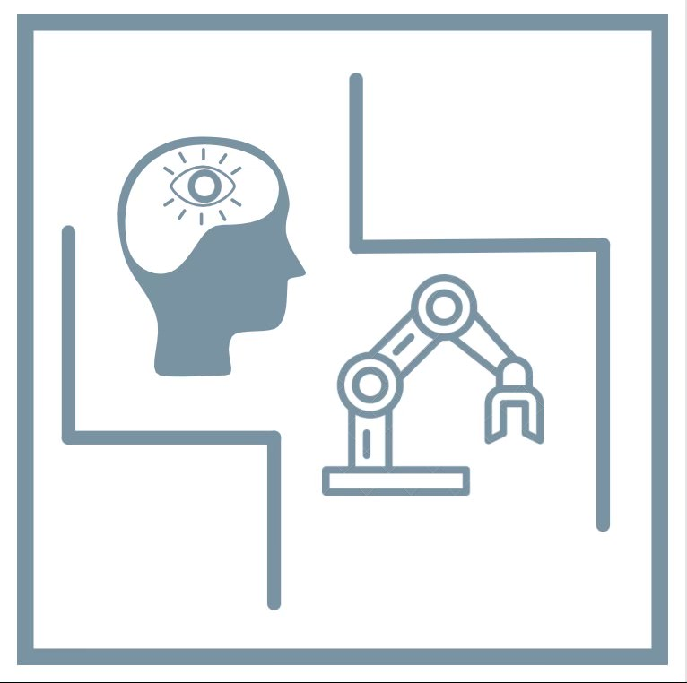

<div id="top"></div>

<!-- PROJECT SHIELDS -->
<!--
*** I'm using markdown "reference style" links for readability.
*** Reference links are enclosed in brackets [ ] instead of parentheses ( ).
*** See the bottom of this document for the declaration of the reference variables
*** for contributors-url, forks-url, etc. This is an optional, concise syntax you may use.
*** https://www.markdownguide.org/basic-syntax/#reference-style-links
-->
[![Issues][issues-shield]][issues-url]
[![MIT License][license-shield]][license-url]
[![LinkedIn][linkedin-shield]][linkedin-url]


<!-- PROJECT LOGO -->
<br />
<div align="center">
  <a href="https://github.com/github_username/repo_name">
    
  </a>

<h3 align="center">DeliveryArmCapstone</h3>

  <p align="center">
    Using facial recognition and URe5 robotic arm for custom delivery of items
    <br />
    <a href="https://github.com/github_username/repo_name"><strong>Explore the docs »</strong></a>
    <br />
    <br />
    <a href="https://youtu.be/27ypUMn-c7k">View Demo</a>
    ·
    <a href="https://github.com/github_username/repo_name/issues">Report Bug</a>
    ·
    <a href="https://github.com/github_username/repo_name/issues">Request Feature</a>
  </p>
</div>


<!-- TABLE OF CONTENTS -->
<details>
  <summary>Table of Contents</summary>
  <ol>
    <li>
      <a href="#about-the-project">About The Project</a>
      <ul>
        <li><a href="#built-with">Built With</a></li>
      </ul>
    </li>
    <li>
      <a href="#getting-started">Getting Started</a>
      <ul>
        <li><a href="#prerequisites">Prerequisites</a></li>
        <li><a href="#installation">Installation</a></li>
      </ul>
    </li>
    <li><a href="#usage">Usage</a></li>
    <li><a href="#roadmap">Roadmap</a></li>
    <li><a href="#license">License</a></li>
    <li><a href="#contact">Contact</a></li>
    <li><a href="#acknowledgments">Acknowledgments</a></li>
  </ol>
</details>


<!-- ABOUT THE PROJECT -->
## About The Project


This project is for ENGT 4050 Capstone and this is our project. I am the group leader for our 6 person team. The idea of our project was to create a more sanitary solution to item delivery in the real world. This brought us to using the URe5 robotic arm along with a Raspberry PI 4 with a PI camera V2 to run the software and collect video. The main idea is to use the arm to grab and place objects and use the PI camera and Raspberry PI to scan for faces to find customers/users to know what and where to place the items. The Raspberry PI will have a database of faces which matches with an order/s so the arm knows what and where to grab and place. In this project we also created our own end effector (gripper) to grab the items and this uses an Ardiuno Nano Connect.


<p align="right">(<a href="#top">back to top</a>)</p>


### Built With

* [Python](https://www.python.org/)
* [Arduino which is pretty much C++](https://www.arduino.cc/en/software)

### Libraries

#### Python
* [URX](https://pypi.org/project/urx/)
* [OpenCV ](https://pypi.org/project/opencv-python/)
* [Face Recognition Models](https://pypi.org/project/face-recognition/)
* [OS](https://docs.python.org/3/library/os.html)
* [Numpy](https://pypi.org/project/numpy/)
#### Arduino
* [ArduinoBLE](https://www.arduino.cc/reference/en/libraries/arduinoble/)
* [Servo](https://www.arduino.cc/reference/en/libraries/servo/)

<p align="right">(<a href="#top">back to top</a>)</p>


<!-- GETTING STARTED -->
## Getting Started

The main setup needed is the installation of the libraries and downloading the repo as well as setting the static IP for the URe5. This project was built on a windows PC so all commands are written for it. If you are running another OS cross your fingers and knock on wood. You will need to program the Arduino Nano Connect on another PC other than the Raspberry Pi. 


### Prerequisites

#### Python
If you are using an IDE,for the python portion, install the libraries through the IDE if it has a way( Sometimes people *like me* don't link the correct python install to their IDE causing library problems). If not, just run these commands in command prompt. This software is meant to run on a Raspberry Pi so, all of these libraries should be installed on the Pi as well as any other enviroment to do work on the software. 

* PiP update (Best Practice)
  ```sh
  python -m pip install --upgrade pip
  ```
* URX
  ```sh
  pip install URX
  ```
* OpenCV
  ```sh
  pip install opencv-python
  ```
* Face Recognition
  ```sh
  pip install face_recognition
  ```
* Numpy
  ```sh
  pip install numpy
  ```
#### Arduino Nano Connect

Be sure to have the [Arduino IDE](https://www.arduino.cc/en/software) downloaded. Open the IDE.

* Install the board manager for the Nano Connect
  * Tools -> Board -> Boards Manager -> In the search box type 
    ```sh
    Arduino Nano Connect
    ```
  * Hover over the item named "Arduino Mbed OS Nano Boards by Arduino" -> Click install
 
* Install the bluetooth library
  * Tools -> Manage Libraries -> In the search box type
    ```sh
    ArduinoBLE
    ```
  * Hover over the item name "ArduinoBLE by Arduino" -> Click install

### Installation

BEFORE TRYING TO INSTALL THE REPO PLEASE INSTALL ALL LIBRARIES. Also, this install is only to be used if you are planning on directly connecting to the URe5 robotic arm. Simulation of the arm will be discussed in a later part.

#### Raspberry Pi

The Pi camera must be install and and ethernet connection must be made between the robotic arm and the Raspberry Pi

1. Clone the repo
   ```sh
   git clone https://github.com/jowdow/DeliveryArmCapstone
   ```
2. Open in your preferred IDE

3. Start the URe5 by pressing the power button on the teach pendant

4. Once ready the arm is ready to use navigate to the system settings
   Change the IP address of the robotic arm to whatever you would like.
   Keep in mind you will need to remember this and this should be kept static
   unless you know what you are doing. The program does not support dynamically
   setting the IP address. 

5. Set the IP address in the program

#### Arduino Nano Connect

The Nano Connect is meant to connect to a servo on the end effector to make it open and close. However, your impentation can be completely different but, it will reqiure changes to the code.

1. Open the Arduino IDE
2. Open the Arduino file in the repo in the folder named Nano Connect
3. Connect the Nano Connect board to the PC and go to Tools -> Port -> Select the port labeled "Arduino Nano RP 2040 Connect"
4. Press the upload button in the top left

<p align="right">(<a href="#top">back to top</a>)</p>

### Simulation
There is a way to install a virtual machine of the robotic arm OS and you can test your program that way. However, I have had access to the arm enough to where this was not nessasary to do. The virtual machine [download](https://www.universal-robots.com/download/?query=sim) is dependent on what virtual machine software is being used and the host pc's operating system. Another factor is what version of the simulator you will use (Use the most up-to-date if you can).

<p align="right">(<a href="#top">back to top</a>)</p>

<!-- USAGE EXAMPLES -->
## Usage

<!--Use this space to show useful examples of how a project can be used. Additional screenshots, code examples and demos work well in this space. You may also link to more resources. -->

This system is meant to be in a place with storage slots that items can be picked and dropped off at a delivery zone. The camera and Raspberry Pi must be close together and the camera must be in a place users can be easily seen. The arm must be programmed in a way to avoid all obstacales. This can be done using multiple "Misc" points however, that would have to be configured in the setup and code. The software has no points default added as to avoid possible confusion/safety issues. 

### Normal Operation

This is a [link](https://youtu.be/27ypUMn-c7k) to a demo of how the program would function. In the video my face is identified and the robotic arm moves and "picks up" my order and "delivers" it.

Other modes of operations are adding zones for pick up/delivery zones. As well as adding faces to be encoded.

<p align="right">(<a href="#top">back to top</a>)</p>


<!-- ROADMAP -->
## Roadmap
### (Here for future)

- [Make small changes to allow for better configuration]
- [Save new locations and faces to files] 
- [Gui?]

See the [open issues](https://github.com/github_username/repo_name/issues) for a full list of proposed features (and known issues).

<p align="right">(<a href="#top">back to top</a>)</p>

<!-- Troublt Shooting -->
## Trouble Shooting

"ImportError: libcblas.so3: cannot open shared object file: No such file or directory". [link](https://stackoverflow.com/questions/53347759/importerror-libcblas-so-3-cannot-open-shared-object-file-no-such-file-or-dire) to solution
  ```sh
  sudo apt-get install libatlas-base-dev
  ```
"ImportError: ImportError: numpy.core.multiarray failed to import". [Link](https://stackoverflow.com/questions/20518632/importerror-numpy-core-multiarray-failed-to-import) to solution
  ```sh
  pip install -U numpy 
  ```
Issues of not being able to see and configure raspberry pi. [This](https://raspberrytips.com/remote-desktop-raspberry-pi/) talks about ways to connect to the pi to see the desktop.

<!-- LICENSE -->
## License

Distributed under the MIT License. See `LICENSE.txt` for more information.

<p align="right">(<a href="#top">back to top</a>)</p>


<!-- CONTACT -->
## Contact

Joseph Douglas - [@jowdow2](https://twitter.com/jowdow2) - jdougla16@rockets.utoledo

Project Link: [https://github.com/jowdow/DeliveryArmCapstone](https://github.com/jowdow/DeliveryArmCapstone)

<p align="right">(<a href="#top">back to top</a>)</p>


<!-- ACKNOWLEDGMENTS -->
## Acknowledgments

* [Thanks to PySource for their facial recognition template](https://www.youtube.com/watch?v=5yPeKQzCPdI)

<p align="right">(<a href="#top">back to top</a>)</p>


<!-- MARKDOWN LINKS & IMAGES -->
<!-- All of these need to be updated -->
<!-- https://www.markdownguide.org/basic-syntax/#reference-style-links -->
[issues-shield]: https://img.shields.io/github/issues/jowdow/DeliveryArmCapstone.svg?style=for-the-badge
[issues-url]: https://github.com/jowdow/DeliveryArmCapstone/issues
[license-shield]: https://img.shields.io/github/license/jowdow/DeliveryArmCapstone.svg?style=for-the-badge
[license-url]: https://github.com/jowdow/DeliveryArmCapstone/blob/master/LICENSE.txt
[linkedin-shield]: https://img.shields.io/badge/-linkedin-black.svg?style=for-the-badge&logo=linkedin&colorB=555
[linkedin-url]: https://www.linkedin.com/in/joseph-douglas937/
[product-screenshot]: https://external-content.duckduckgo.com/iu/?u=https%3A%2F%2Fwww.hmi-mbs.fr%2Fwp-content%2Fuploads%2F2020%2F08%2FUR5e-robot-collaboratif-UNIVERSAL-ROBOTS-automation.png&f=1&nofb=1
